# GCS Analytics Core

[](https://github.com/GoogleCloudPlatform/gcs-analytics-core/releases/latest)
[](https://github.com/GoogleCloudPlatform/gcs-analytics-core/releases/latest)
[](https://search.maven.org/search?q=g:%22com.google.cloud.gcs.analytics%22%20AND%20a:%22gcs-analytics-core%22)
[](https://codecov.io/gh/GoogleCloudPlatform/gcs-analytics-core)
[](https://api.securityscorecards.dev/projects/github.com/GoogleCloudPlatform/gcs-analytics-core)

## Introduction

The GCS Analytics Core is a Java library designed to optimize and accelerate analytics workloads on Google Cloud Storage (GCS). It provides a common set of functionalities and performance enhancements for Java applications interacting with GCS, particularly those using big data processing frameworks like Apache Spark, Trino, Apache Hive, and others that leverage the Google Cloud Storage connector for Hadoop or interact with Apache Iceberg tables through its GCSFileIO implementation.

This library aims to provide a consistently high-performance experience for all analytics workloads on GCS by centralizing key optimizations and simplifying configuration.

## Key Features

-   **Vectored I/O**: Improves read performance by fetching multiple data ranges in a single operation, significantly reducing the number of round trips to GCS.
-   **Parquet Footer Caching and Prefetching**: Caches Parquet file footers in memory to avoid redundant reads and accelerate query planning and execution.
-   **Optimized GCS Interactions**: Streamlined communication with GCS APIs to minimize latency and enhance throughput.
-   **Unified and Simplified Configuration**: Provides a single, optimized path to GCS, reducing the need for framework-specific tuning for GCS access.


## Architecture

The GCS Analytics Core library provides an optimized client layer `GcsFileSystem` and `GoogleCloudStorageInputStream`
which is a seekable input stream implementation that can be used by applications to interact with GCS. It sits between
the analytics frameworks and the underlying GCS Java library, intercepting calls to inject performance optimizations.

```mermaid
graph TD
    %% Top Layer: Analytics Engines
    subgraph Clients ["Analytics Engines"]
        direction LR
        AE1["Analytics Engine<br>(e.g., Spark, Trino, Hive)"]
        AE2["Analytics Engine<br>(e.g., Iceberg GCSFileIO)"]
    end

    %% Middle Layer: GCS Analytics Core
    subgraph Core ["GCS Analytics Core"]
        direction TB
        %% Internal Components representing the features from the text
        subgraph Features ["Core Features & Implementations"]
            direction TB
            subgraph GCSIS ["GoogleCloudStorageInputStream"]
                VIO["VectoredRead"]
                PFP["Parquet Footer Prefetch"]
                ARR["Adaptive Range Read"]
            end
            subgraph GFS ["GcsFileSystem"]
                GACO["GcsAnalyticsCoreOptions"]
            end
            direction LR
            GCSIS -- "open()" -->  GFS
        end
    end

    %% Lower Layers
    Lib["GCS SDK"]
    GCS[("Google Cloud Storage (GCS)")]

    %% Relationships
    AE1 -- "Hadoop GCS Connector" --> Core
    AE2 --> Core

    %% Flow downwards
    Core --> Lib
    Lib --> GCS

    %% Styling for visual clarity
    classDef engine fill:#f9f9f9,stroke:#333,stroke-width:1px;
    classDef core fill:#e3f2fd,stroke:#1565c0,stroke-width:2px;
    classDef feature fill:#ffffff,stroke:#1565c0,stroke-dasharray: 5 5;
    classDef lib fill:#fff3e0,stroke:#ef6c00,stroke-width:1px;
    classDef storage fill:#e8f5e9,stroke:#2e7d32,stroke-width:1px;

    class AE1,AE2 engine;
    class Core core;
    class VR,FP,FS feature;
    class Lib lib;
    class GCS storage;
```



## Current Status

The library currently implements optimizations for read operation on columnar file formats (eg: parquet) stored in GCS
buckets.

## Getting Started

### Prerequisites

-   Java Development Kit (JDK) 11 or later.

### Adding gcs-analytics-core to your build

Maven group ID is `com.google.cloud.gcs.analytics` and artifact ID is `gcs-analytics-core`.

To add a dependency on GCS Analytics Core using Maven, use the following:

```xml
<dependency>
  <groupId>com.google.cloud.gcs.analytics</groupId>
  <artifactId>gcs-analytics-core</artifactId>
  <version>x.y.z</version> <!-- Replace with the latest version -->
</dependency>
```

For other build systems like Gradle, please refer to Maven Central.

### Configuration

Configuration options for the library are typically provided through the [`GcsAnalyticsCoreOptions`](core/src/main/java/com/google/cloud/gcs/analyticscore/core/GcsAnalyticsCoreOptions.java) class. Detailed configuration parameters can be found in the [CONFIGURATION.md](CONFIGURATION.md) file.

### Usage Examples
To leverage the read operation performance optimizations of this library, replace the InputStream implementation in your implementation
with the [`GoogleCloudStorageInputStream`](core/src/main/java/com/google/cloud/gcs/analyticscore/core/GoogleCloudStorageInputStream.java)
implementation provided by the library. Example steps to initialize the [`GoogleCloudStorageInputStream`](core/src/main/java/com/google/cloud/gcs/analyticscore/core/GoogleCloudStorageInputStream.java)
implementation:

1. Create configuration object

    1. Create configuration object from map of flags (refer [CONFIGURATION](CONFIGURATION.md) for supported flags):
        ```java
        ImputableMap<String, String> flagsExample1 = ImmutableMap.of(
                "gcs.project-id", "my-project-id",
                "gcs.analytics-core.footer.prefetch.enabled", "true");
        GcsAnalyticsCoreOptions gcsAnalyticsCoreOptions = new GcsAnalyticsCoreOptions("gcs.", flagsExample1);

        ImputableMap<String, String> flagsExample2 = ImmutableMap.of(
                "fs.gs.project-id", "my-project-id",
                "fs.gs.analytics-core.footer.prefetch.enabled", "true");
        GcsAnalyticsCoreOptions gcsAnalyticsCoreOptions = new GcsAnalyticsCoreOptions("fs.gs.", flagsExample2);
        ```

    2. Create configuration object by  directly initializing GcsFileSystemOption:
        ```java
        GcsFileSystemOptions gcsFileSystemOptions = GcsFileSystemOptions
                .builder()
                .setGcsClientOption(GcsClientOptions.builder().setProjectId("my-project-id").build())
                .build();
        ```

2. Initialize [`GcsFileSystem`](client/src/main/java/com/google/cloud/gcs/analyticscore/client/GcsFileSystem.java) with configuration:
    ```java
    GcsFileSystem gcsFileSystem = new GcsFileSystemImpl(gcsAnalyticsCoreOptions.getGcsFileSystemOptions());
    // or
    GcsFileSystem gcsFileSystem = new GcsFileSystemImpl(gcsFileSystemOptions);
    ```

3. Initialize GoogleCloudStorageInputStream for an object with GcsFileSystem:
    1. Using [`GcsFileInfo`](client/src/main/java/com/google/cloud/gcs/analyticscore/client/GcsFileInfo.java)
        (Recommended if object metadata already known) : Use this interface when object metadata like
        length is already known as it avoid additional metadata API calls when required in methods like `readTail`.
        ```java
        GcsFileInfo fileInfo = GcsFileInfo.builder().setGcsItemInfo().build();
        GoogleCloudStorageInputStream stream = new GoogleCloudStorageStream.create(gcsFileSystem, fileInfo);
        ```
    2. Using [`GcsItemId`](client/src/main/java/com/google/cloud/gcs/analyticscore/client/GcsItemId.java):
       ```java
        // Using GcsItemId
        GcsItemId gcsItemId = GcsItemId.builder().setBucketName("example-bucket").setObjectName("file.parquet").build();
        GoogleCloudStorageInputStream stream = new GoogleCloudStorageStream.create(gcsFileSystem, gcsItemId);
        ```
    3. Using GCS Object URI:
        ```java
        // Using GCS Object URI
        URI path = URI.create("gs://my-bucket/my-object");
        GoogleCloudStorageInputStream stream = new GoogleCloudStorageStream.create(gcsFileSystem, path);
        ```
4. Refer [`SeekableInputStream`](core/src/main/java/com/google/cloud/gcs/analyticscore/core/SeekableInputStream.java)
   interface or [`GoogleCloudStorageInputStream`](core/src/main/java/com/google/cloud/gcs/analyticscore/core/GoogleCloudStorageInputStream.java)
   implementation for the methods supported by the input stream.
5. Ensure `close()` is called on the inputstream when the stream is no longer required to free the resources.


## Development
### Building from Source

To build the library:

```shell
./mvnw clean package
```

### Running Tests

To verify the test coverage, run the following commands from main directory:

```shell
./mvnw -P coverage clean verify
```

The coverage report can be found in `coverage/target/site/jacoco-aggregate`.

To run integration tests:

```shell
# Ensure you are authenticated
gcloud auth application-default login

# Run the tests
./mvnw -Pintegration-test verify \
  -Dgcs.integration.test.bucket=$BUCKET \
  -Dgcs.integration.test.project-id=$PROJECT_ID \
  -Dgcs.integration.test.bucket.folder=$FOLDER_NAME
```

Replace `$BUCKET`, `$PROJECT_ID`, and `$FOLDER_NAME` with your specific GCS bucket details.


## Micro Benchmarks

The project contains micro benchmark on top of parquet-java library. The benchmark creates a random parquet file with
customer schema from TPCDS benchmark and performs 2 operations :
1. Parse parquet footer.
2. Prase parquet footer and read parquet records.

To run the micro benchmarks:

```shell
./mvnw -Pjmh clean package

java -Dgcs.integration.test.bucket=$BUCKET_NAME \
     -Dgcs.integration.test.project-id=$PROJECT_ID \
     -Dgcs.integration.test.bucket.folder=$FOLDER_NAME \
     -jar core/target/benchmarks.jar
```

### Micro benchmark results
#### Parquet Footer Parsing

Parquet File Size   |   Footer Prefetch Disabled    | Footer Prefetch Enabled   |   Performane Gain
--- |   --- |   --- |   ---
3MB |   82.58   |   57.99   |   29.78%
30MB    |   84.24   | 56.3  |   33.17%
300MB   |   95.3    |   60.4    |   36.62

#### Parquet record read

Parquet File Size   | Vectored IO Disabled | Vectored IO + Footer Prefetch Enabled |   Performane Gain
--- |----------------------|---------------------------------------|   ---
3MB | 228.58               | 156.42                                |   31.57%
30MB    | 477.56               | 371.87                                |   22.13%
300MB   | 2865.27              | 2562.71                               |   10.56%
3000MB  | 28747.96  |   25263.00    |   12.12%

## Contributing

We welcome contributions! Please see [CONTRIBUTING.md](docs/contributing.md) for more details on how to get started.

## Security

If you discover a potential security issue in this project, please notify us by following the instructions in [SECURITY.md](SECURITY.md).

## Code of Conduct

This project has adopted the Google Open Source Community Guidelines. Please see [code-of-conduct.md](docs/code-of-conduct.md).

## License

This library is licensed under the Apache 2.0 License. See the [LICENSE](LICENSE) file for more details.
